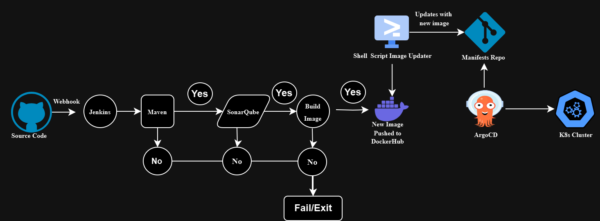

# Java Maven CI/CD Pipeline with Jenkins and ArgoCD (GitOps-Driven)



This repository demonstrates a fully automated CI/CD pipeline for a Java  application. It leverages **Jenkins**, **Docker**, and **ArgoCD** to build, test, containerize, and deploy the application using modern GitOps practices.

The project emphasizes automation, reproducibility, and traceability by integrating containerized Jenkins agents, GitOps workflows, and deployment orchestration with ArgoCD.

---

## Key Features

1. **Jenkins with Docker Agent**:  
   - The Jenkins pipeline uses a Docker container as its build agent, providing a clean and isolated environment for each pipeline run.

2. **End-to-End Automation**:  
   - Builds, tests, and performs static code analysis automatically.  
   - Creates and pushes container images to Docker Hub.  
   - Updates deployment manifests with a shell script.  

3. **GitOps Practices**:  
   - The deployment process is version-controlled.  
   - ArgoCD syncs the Kubernetes cluster state with the updated deployment manifest from Git.

4. **Scalable CI/CD Pipeline**:  
   - Configured for multi-stage workflows: build, test, analyze, containerize, and deploy.  

5. **Reliability and Traceability**:  
   - Each container image is tagged with a unique Jenkins build number.  
   - Deployment manifests are tracked in Git, ensuring all changes are auditable.

---

## Benefits of Using Docker as Jenkins Agent

The pipeline uses Docker as an agent, defined in the `Jenkinsfile` under the `agent` block:

```groovy
agent {
    docker {
        image 'abhishekf5/maven-abhishek-docker-agent:v1'
        args '--user root -v /var/run/docker.sock:/var/run/docker.sock --rm --add-host=host.docker.internal:host-gateway'
    }
}

```

## Why Use Docker as an Agent?

### Benefits:

1. **Isolation**:  
   Each build runs in its own container, eliminating conflicts between builds or dependencies.

2. **Reproducibility**:  
   The build environment (tools, dependencies, configurations) is defined in the Docker image, ensuring consistent behavior across runs.

3. **Portability**:  
   The Docker image can run anywhere Docker is available, making the pipeline environment agnostic to the underlying Jenkins server.

4. **Flexibility**:  
   You can use different Docker images for different stages, customizing the environment based on the build requirements.

In this project, the `abhishekf5/maven-abhishek-docker-agent:v1` image includes all necessary tools (e.g., Maven, Docker CLI), streamlining the build process.

---

## Pipeline Workflow

The CI/CD pipeline is defined in the `Jenkinsfile` and includes the following stages:

1. **Checkout**:  
   Clones the repository to fetch the latest code.

2. **Build and Test**:  
   Compiles the code, packages it into a JAR file, and runs unit tests.

3. **Static Code Analysis**:  
   Analyzes the code using SonarQube for improved code quality.

4. **Build and Push Docker Image**:  
   - Builds a container image for the application.  
   - Tags the image with the Jenkins build number and pushes it to Docker Hub.

5. **Update Deployment File**:  
   - Updates the Kubernetes deployment manifest with the new Docker image version using a shell script.  
   - Commits and pushes the updated manifest back to the repository.

6. **GitOps Deployment**:  
   - ArgoCD detects the updated deployment manifest and syncs the changes to the Kubernetes cluster automatically.

---

## GitOps Workflow with Shell Script

This project follows GitOps principles to manage application deployments:

1. The pipeline's **Update Deployment File** stage uses a shell script to update the `image` field in the deployment manifest (`deployment.yml`) with the new Docker image tag.

2. The updated manifest is committed and pushed to the Git repository.

3. ArgoCD automatically syncs these changes to the Kubernetes cluster, ensuring the desired state is always maintained.

This process eliminates manual intervention, reduces the risk of configuration drift, and provides full traceability of deployment changes.

---

## Prerequisites

### **Jenkins**:
- A Jenkins server configured to run pipelines with Docker agents.  
- Credentials:
  - `docker-cred`: Docker Hub credentials.  
  - `github`: GitHub Personal Access Token.  
- Plugins:
  - Docker Pipeline, SonarQube Scanner, Pipeline: Groovy.

### **SonarQube**:
- An instance of SonarQube integrated with Jenkins using Token created on Sonarqube for code analysis.

### **ArgoCD**:
- Deployed in your Kubernetes cluster.  
- Configured to monitor this repository and sync deployment changes.

---

## Setting Up the Pipeline

### Clone this Repository:

```bash
git clone https://github.com/your-username/java-maven-sonar-argocd-k8s.git
cd java-maven-sonar-argocd-k8s


## Configure Jenkins

1. **Add a new Jenkins pipeline job** and point it to this repository.  
2. **Define the necessary credentials**:  
   - `docker-cred`: Docker Hub credentials.  
   - `github`: GitHub Personal Access Token.

---

## Run the Pipeline

Trigger the pipeline in Jenkins. It will:  
- Build and test the application.  
- Push the Docker image to Docker Hub.  
- Update the Kubernetes deployment manifest.

---

## GitOps Deployment

ArgoCD will detect the updated deployment manifest and deploy the application to the Kubernetes cluster automatically.

---

## Example Directory Structure

```bash
java-maven-sonar-argocd-helm-k8s/
├── spring-boot-app/                # Java Maven application code
├── spring-boot-app-manifests/      # Kubernetes deployment manifests
├── Jenkinsfile                     # CI/CD pipeline definition
├── README.md                       # Project documentation


